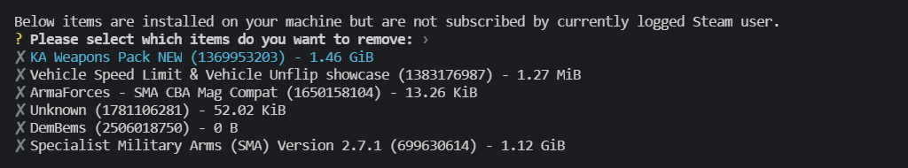

# Workshop Cleaner 

This simple utility (mainly written as Rust language learning excercise) will search for Steam Workshop items that are installed but not subscribed by currently logged user.

It can be used to clean up your disk in case Steam "forgot" to remove the items after you stopped subscribing to them.

Currently it's only checking for Arma 3 items (App id: 107410), this can be changed in `main.rs` of the CLI app.

## Demo

